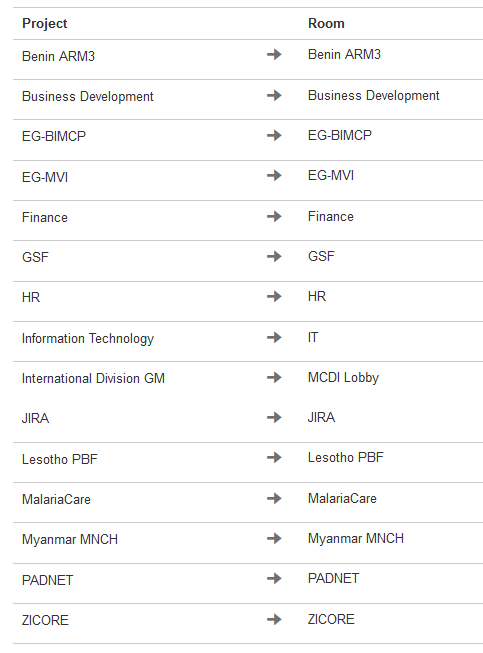
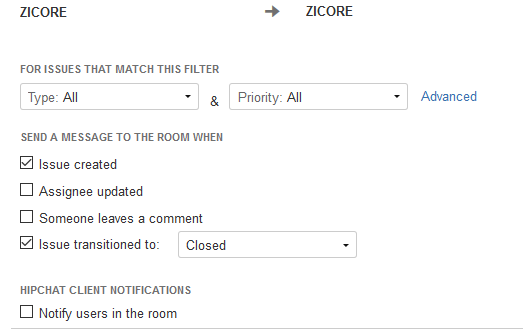

##HipChat Integration, Phase I

- HipChat (Cloud) is now wired to JIRA with the following hardlinks:

- This feature is currently being tested in a *passive* configuration to fine-tune push notifications.  The current default settings are shown below:

- Current JIRA users will not be able to utilize the HipChat integration features present on issues until we move to an *active* configuration.

- We are aiming to roll out HipChat alongside the Open Beta.  For more information on the Open Beta, see [!!JIRA-7](http://ec2-54-162-47-42.compute-1.amazonaws.com:8080/browse/JIRA-7).

- The @mcd.org domain has been enabled for automatic HipChat verification.  In theory, all we will need to do in order to push out invites is to release our HipChat invite URL.

##Applied Fix JIRA-6

- Fixed a configuration problem that was storing attachments on the root volume instead of the storage volume.  See [!!JIRA-6](http://ec2-54-162-47-42.compute-1.amazonaws.com:8080/browse/JIRA-7) for more information.
