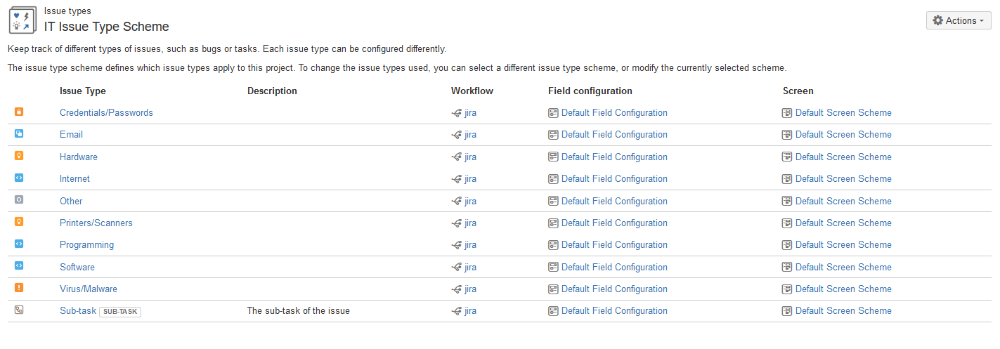

##Open Beta Rollout

- The following projects have been enabled for use:
  - BARM3
  - PADNET
  - MalariaCare
  - GSF
  - Executive

##Base Issue Type Scheme Added

- In order to customize issue types from project to project as needed, it was necessary to create a "Base Issue Type Scheme" and associate it with all Business projects. - This will allow us to modify the issue types for each individual project if necessary.
- See the ["How to edit default issue type scheme" thread on Atlassian Answers](https://answers.atlassian.com/questions/16635/how-to-edit-default-issue-type-scheme-or-how-to-remove-issue-type-from-being-global) and [!JIRATEK-13](http://ec2-54-162-47-42.compute-1.amazonaws.com:8080/browse/JIRATEK-13) for more information on the reasoning behind this change.

##IT Project Key Change
- The IT project's key has been changed from (IT) to (ITHD) to fix an incoming mailer configuration string-match bug.
- The ITHD project has been wired to the ITHD.incoming endpoint.

##Preparations for the Transition of MCDI IT Case Handling to JIRA
- The ITHD project has been wired to all notification services, with an additional default notification route targeting the help@mcd.org inbox.  See [!JIRATEK-16](http://ec2-54-162-47-42.compute-1.amazonaws.com:8080/browse/JIRATEK-16) for more information.
- The ITHD project has been moved to a custom Issue Type Scheme to provide proper functionality.  See [!JIRATEK-15](http://ec2-54-162-47-42.compute-1.amazonaws.com:8080/browse/JIRATEK-15) for more information.

The current configuration is shown below: 
