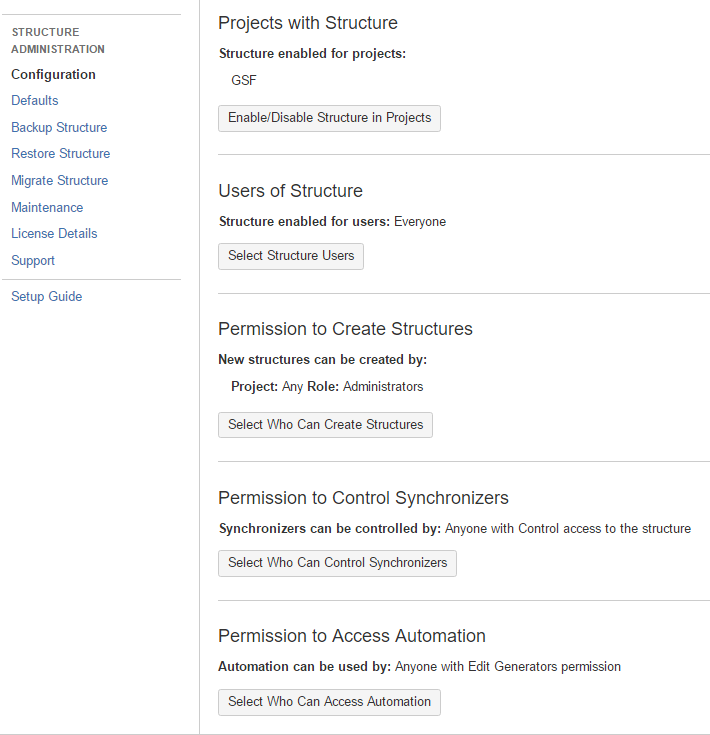
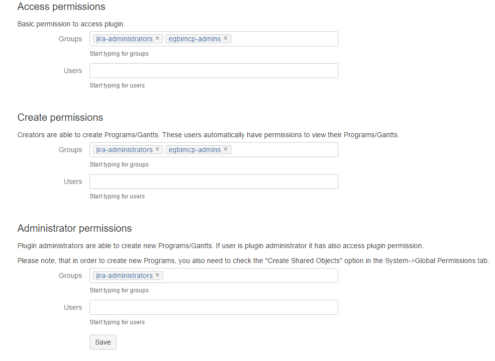

##MYMNCH Project Renamed
- The MYMNCH Project has been renamed to MYCCST.
- Mailers, filters, and routing have been rewired to accommodate this fact.
- See [!JIRATEK-25](http://ec2-54-162-47-42.compute-1.amazonaws.com:8080/browse/JIRATEK-25) for more information on the change.

##Structure Plugin Added (Internal Beta)
- The [Structure Enterprise Issue Organizer](https://wiki.almworks.com/display/structure) plugin has been added to JIRA to allow more flexibility in creating issue hierarchies (see [!JIRATEK-29](http://ec2-54-162-47-42.compute-1.amazonaws.com:8080/projects/JIRATEK/issues/JIRATEK-29) for more information).
- Structure is currently configured as follows:



- The GSF project administrators have agreed to conduct a limited test of Structure within their environment prior to the 0.1.5.0 release.  Pending the outcome of the test, a decision will be made regarding rolling out the plugin for all projects as part of the 0.1.6.0PR1 release.

- As MCDI is running on a JIRA nonprofit license, the system is automatically allocated a nonprofit license for Structure.  Administrators should note that even though the plugin appears as unlicensed within the JIRA plugin manager, it is a fully licensed version.

```
If you have installed a license from ALM Works, Plugin Manager may show that Structure is Unlicensed
or Action Required, because it's not aware of ALM Works license. You can check true license status on
Administration | Structure | License Details page
If it shows you that the license is OK, you can safely ignore the status of the license in Plugin Manager.
```

- [More information on the license model for Structure can be found here](https://wiki.almworks.com/display/structure/Setting+Up+Structure+License).

##Orcs Removed
- Disabled all mcdi.orc accounts used for early smoke testing.  These accounts will continue to persist within the system, but will need to be reactivated before they can be used.

##Administrative Documentation
- Added a section to the documentation for documenting administrative functions.

##Process Documentation
- Added a section to the documentation for documenting specialized processes.

##Classified Incident Reporting Process Support Added
- Added "Classified Incident Reporting" component to the HR project.
- Added "Classified Incident Reporting" ISSEC level.
- Added hr-classified-users group.
- Created "Classified Incident Reporting" folder in the HR project.
- Please note that while hr-admins and hr-classified-users can View and Edit within the folder, only jira-administrators have the Delete permission.
- Process documentation for handling classified incident reports is in development.  [Once complete, it will be available here](process_cir.md).

##BigPicture Plugin Added (Internal Beta)
- The [BigPicture](https://marketplace.atlassian.com/plugins/eu.softwareplant.bigpicture/server/overview) plugin has been added to JIRA to allow for enterprise-level portfolio management and Gantt chart support.
- BigPicture is currently configured as follows:



- The EGBIMCP project administrators have agreed to conduct a limited test of BigProject within their environment prior to the 0.1.5.0 release.  Pending the outcome of the test, a decision will be made regarding rolling out the plugin for all projects as part of the 1.0.0.0R1 release.

##EGBIMCP Injected from SharePoint
- A rudimentary CSV transform consisting of data from the 2016 WP subsite of the EGBIMCP SharePoint was used to mass-inject the task list into JIRA for use with the BigPicture plugin.
- This is **not a recommended practice,** as the transform relies on perfect mapping.  This can only be achieved by making a number of assumptions regarding initial issue-states (i.e. overwriting assigned users/reporters to avoid assigning to nonexistent users), or conducting an extensive cell-by-cell review of the task list that is being injected.
- In this case, as the issues are _only intended to be used for the production of a Gantt deliverable,_ the above assumptions do not necessarily matter.  Once the deliverable has been produced, all injected issues will be bundled and archived as a release under the EGBIMCP project.  
- It has been communicated to the EGBIMCP administrators that _no work of any kind_ should take place within the injected issues.  All 2016 WP activities that were not migrated as part of the Alpha or Beta phases will follow the on-demand manual migration plan outlined in the JIRA rollout timeline.
