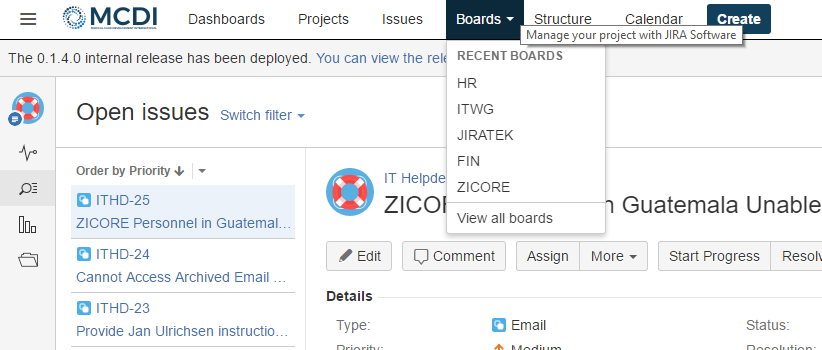
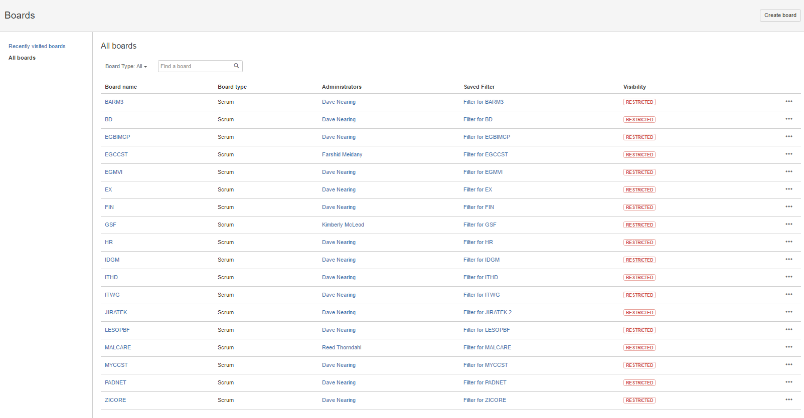
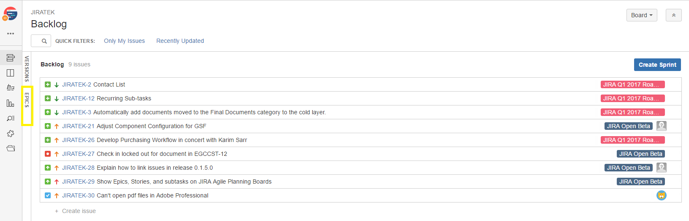
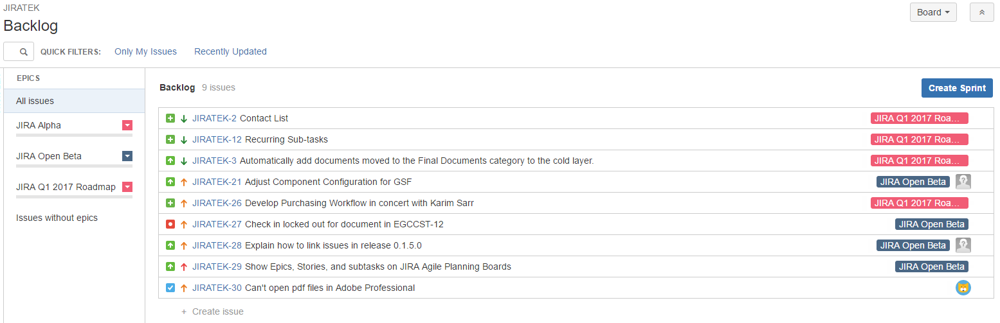
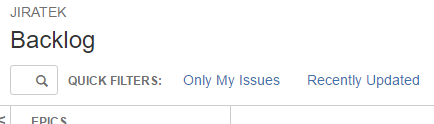
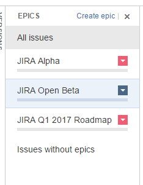
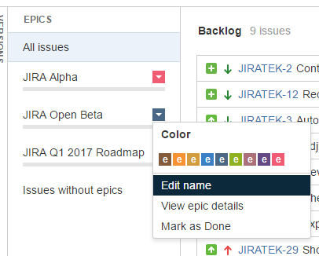
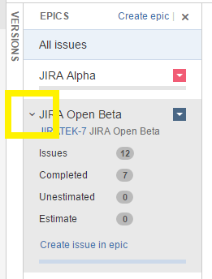
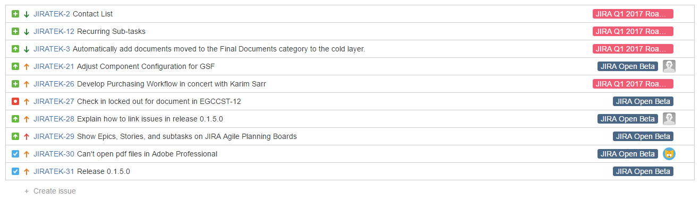
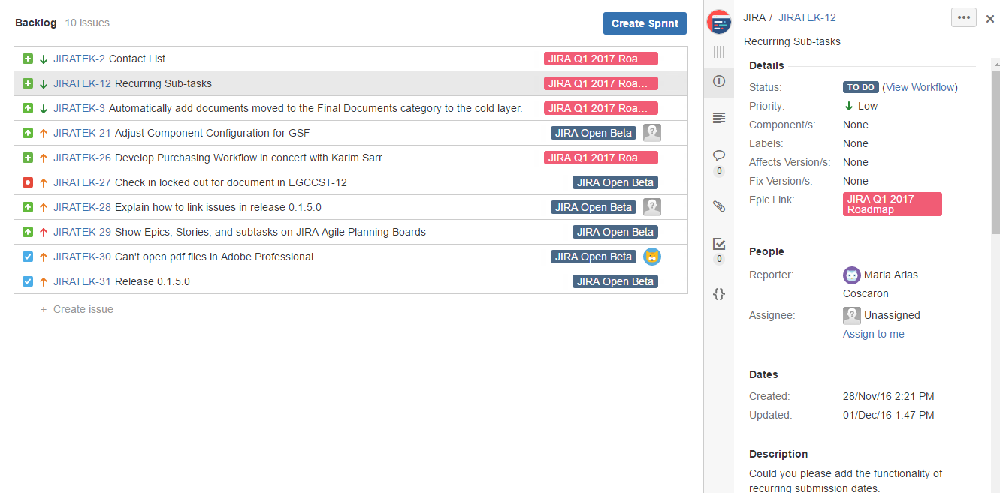

The purpose of this article is to provide information related to the use of JIRA's Agile Boards function for administrating projects.

##Atlassian Documentation
[You can view an overview of how boards work in JIRA here.](https://confluence.atlassian.com/jirasoftwarecloud/what-is-a-board-764477964.html)

In order to assure that all necessary functions are available, all default boards have been created as [Scrum boards](https://confluence.atlassian.com/jirasoftwarecloud/using-your-scrum-backlog-764478062.html).  

The term "Scrum" refers to a specific kind of [Agile development methodology](https://en.wikipedia.org/wiki/Agile_software_development)- knowledge of Agile development processes is by no means required to use boards, however, if you would like to learn more about Agile concepts, feel free to check out [agilemethodology.org](http://agilemethodology.org).

-----

##A Word of Caution
While _any_ JQL query or [filter](filters.md) can be used to create a board, interacting with multiple projects concurrently within the same board poses some risks to the underlying organization of the system.  

Wherever possible, please refrain from creating new boards on your own.  If you require a custom board, please log a feature request under the [!JIRATEK](http://ec2-54-162-47-42.compute-1.amazonaws.com:8080/projects/JIRATEK/issues/JIRATEK-29?filter=allopenissues) project so that IT can conduct a full review of the potential impact.

-----

##Accessing a Project's Board

To access the Board for a project:

  * Click the "Boards" tile on the top bar, and select your desired board.

If you do not see the desired board in the "Recent Boards" section, click "View all boards," then click the name of board that you wish to view.

-----

##The Backlog Screen

The root screen of the Board function is called the "Backlog."  Before progressing further, please click the "Epics" tab on the left-hand side of the screen.

Clicking the "Epics" tab will cause a new pane to slide out from the left-hand side of the screen that contains all of the Epics for the project associated with the board.

-----

##Layout

The Backlog screen consists of 4 main regions:

  * Filter Bar
  * Epics Pane
  * Backlog Pane
  * Issue Pane

###Filter Bar

- The Filter Bar allows you quick access to search and common filters.

###Epics Pane

- The Epics Pane provides a quick view of the epics within the board you are working on.  
- Clicking the colored dropdown button within a given Epic card will allow you to perform several potentially useful operations on said Epic, as shown below:

- Clicking the arrow in the top left hand of an Epic's card will reveal a more detailed breakdown of the work contained within that Epic, as shown below:

###Backlog Pane

- The backlog pane shows a view of issues matching your currently selected filter, tagged with information about the Epic they are a part of.  
- You can add issues directly to a project from this screen by clicking the "+ Create Issue" button at the bottom of the page.
- You can reorganize the order of issues on your backlog screen by dragging and dropping.

###Issue Pane

- Double-clicking an issue in the Backlog will pull up that issue in the Issue Pane on the right hand side of the screen.
- This pane provides almost exactly the same functionality as a vanilla Issue view screen, so you can make edits, leave comments, and add attachments without leaving the Board interface.

-----

##Common Use Cases

Boards _are not_ intended to be used as a replacement for interacting with issues through the Issue View screen.  Their primary function within the context of MCDI's installation is to provide a command and control (C&C) layer above the one utilized by all users, which can be used to perform limited advanced recovery and batch operations.

Below you will find two scenarios which can be resolved utilizing the Boards interface, but which _cannot_ be easily resolved within the default view.

###Adopting an Orphaned Story

If a Story is created as an orphan (without a parent Epic), it can be associated with an Epic after the fact through the Boards interface as follows:

- Open the Epics pane.
- Find the issue you would like to associate in the Backlog.
- Click and drag the issue you would like to associate from the Backlog onto the card for the Epic you would like to link it to.
- JIRA will automatically handle the operations required to make the association in the background while you continue to work.  In most cases, this process takes less than a second.

###Rapid Prototyping

- The quick-creation links for adding issues within the Boards screen can be used by project managers to quickly wireframe a project or activity.  

- This is not recommended for actively working on issues, but can be extremely useful when there are a large number of issues that need to be added to the system in advance of some forthcoming work activity.
