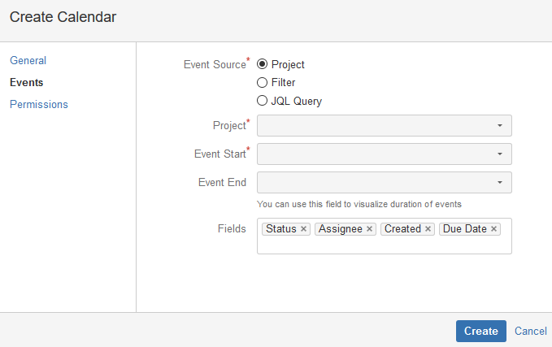
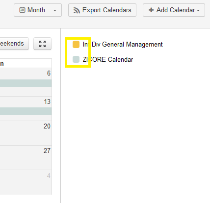

The purpose of this article is to provide information related to the creation and management of calendars in JIRA.

##Mail.ru Calendar

The calendar functionality in JIRA is provided by the [Mail.ru plugin.](plugin_mail_ru)  

-----

##Accessing the Calendar

To access the calendar, click the "Calendar" button at the top of the screen.

-----

##Adding a Calendar

To create a calendar view, click the "Add Calendar" button and select an option.  

###Create New Calendar
Creating a new calendar will allow you to define a calendar filter based on your specifications.  

You will first need to name your calendar and select a color for the calendar events.  Once you have configured these fields, click the "Events" link in the left-hand pane.

This screen allows you to configure your event source, which is essentially a "feed" of information to be displayed.  Event sources can be configured to display issues from a given project, issues caught by one of your saved [filters](filters), or issues returned by a [JQL query](filters#jira-query-language-jql-filtering).  

You can choose what fields from the selected event source will be displayed on the calendar by entering their names in the "Fields" box.

Once you have defined your event source, you can set sharing permissions for your calendar if you would like to share it.  Granting "USE" rights will allow users to add your calendar to their calendar view.  Granting "ADMIN" rights will allow users to make configuration changes to your calendar.

-----

###Add Existing Calendar

The "Add Existing Calendar" screen will allow you to find and subscribe to calendars that have been shared with you.

Simply check the checkbox next to the calendar(s) you would like to subscribe to and click the "Add" button.  The calendar will then appear in the right hand pane- to toggle the visibility of a given calendar, click the square next to the calendar name.

-----

##Setting Up Calendar Sync
One of the most powerful features of the [Mail.ru plugin.](plugin_mail_ru) is the ability to sync calendars created within JIRA to Outlook, iCalendar, iOS Calendar, Google Calendar, and other applications. Events for the past 3 months and up to 1 month in the future will be synced.

To sync a calendar/calendar group with Outlook, follow these steps:

1) Click the "Export Calendars" button.

2) Enter the names of the calendar(s) you would like to include in the calendar feed in the first box.

3) Copy the link from box 2, then open the Calendar pane in Outlook and navigate to "Open Calendar -> From Internet..."

4) Enter the link you copied in step 3 into the box that appears and click OK.

5) The following screen will appear.  Click "Yes."

6) You're all set.  The calendar will appear as "Untitled" under the "Other Calendars" heading in Outlook.  At this point, you can rename it however you like.  The calendar will automatically sync with JIRA with no further steps on your part.

