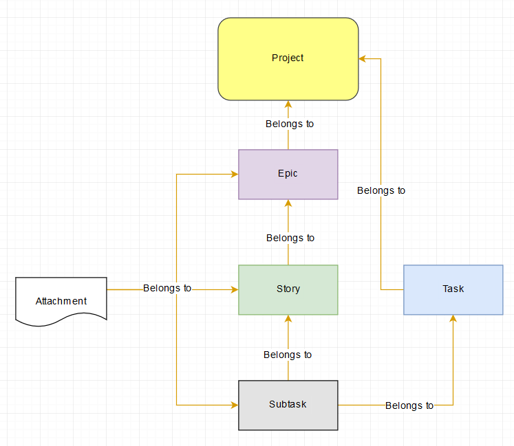

The purpose of this article is to provide access detailed information about the types of issues in MCDI's JIRA Core projects, and their proper usage.

##Hierarchy

Issues in JIRA are organized into a parent-child hierarchy under a given JIRA Core project, as illustrated below.

-----

##Epics

An epic captures a large body of work. It is essentially a large undertaking (similar to a SharePoint "Component") that can be broken down into a number of smaller Stories (similar to SharePoint "Activities").

Examples of Epics:

* Home Office Administration
* Field Office Administration
* Project Beta Test

The average user **should not** have a business need to create an Epic, unless directed to do so by a superior.  

-----

##Stories

A Story is the hierarchical unit of work directly below the Epic level.  A given Epic will generally have many Stories below it.  Stories roughly correspond to "Activities" in SharePoint, and can be broken down into a number of smaller Subtasks.

Examples of Stories:

* Contracting
* Purchasing
* Logistics
* Communications
* Reporting

-----

##Subtasks

A Subtask is the lowest hierarchical unit of work, which lies below the Story level.  Subtasks roughly correspond to "Tasks" in SharePoint.  Subtasks are where the majority of work and comment activity will take place.  

Examples of Epics:

* Approve contract for consultant
* Purchase 28 widgets
* Send email to donor
* Produce monthly report

-----

##Tasks

The "Task" issue type is reserved for one-off issues that do not fit within an established Epic/Story/Subtask hierarchy tree.  They act in a similar fashion to Stories from a mechanical perspective.

-----

##Issue Type Decision Tree

When in doubt about what type of issue you should create, please refer to the chart below:

-----
