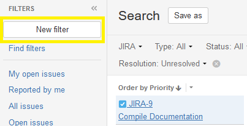
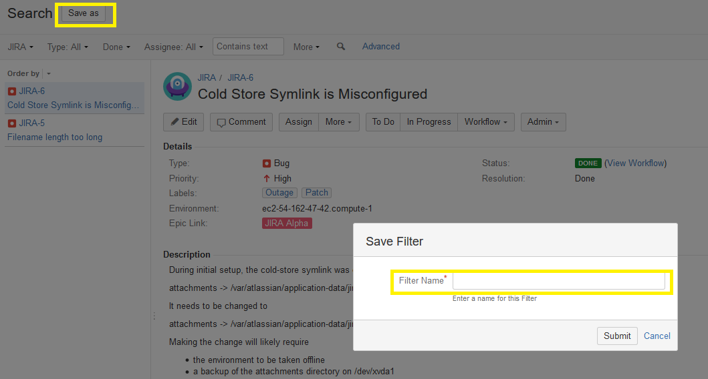
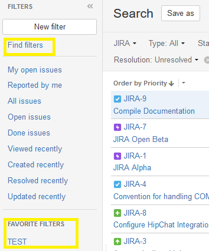
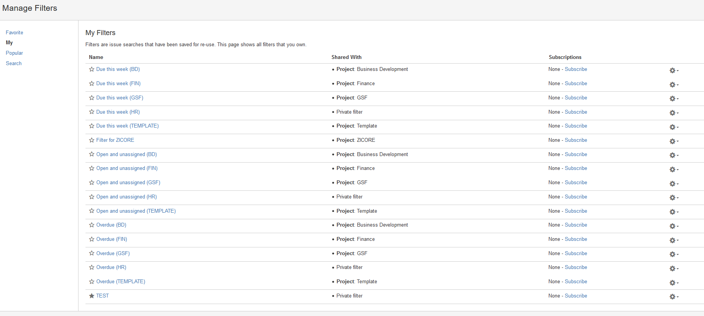

The purpose of this article is to provide information related to the creation and usage of filters for the purpose of finding, viewing, and organizing issues within a project.

##Accessing the Filter Editor

To access the Filter Editor:

  * Navigate to the Issues section of a project.  
  * Click the "View all issues and filters" link in the top right.

  * Click the "New filter" button in the top left.

  * Once you have the Filter Editor open, design your filter using the dropdown menus in the top menu bar.  
  * The issues displayed on the screen after each change will be the issues that match your filter.

##JIRA Query Language (JQL) Filtering

Should you require additional filtering over and above the simple column filters provided in the UI, you can access the JQL interface by clicking the "Advanced" link.  This interface accepts query statements written in JQL, which allows you to create powerful cross-sections of data with relative ease.  [For more information on JQL syntax, please refer to this cheat sheet.](https://gist.github.com/emmajane/59321345a81a4f5837c0)

##Saving a Filter

When you have created the filter you want, click the "Save as" button in the top left corner of the interface, enter a name for the filter in the "Filter Name" box, and click the "Submit" button.

Once the filter has been saved, you can access it from the "View all issues and filters" screen.  Your most used filters will appear in the "Favorite Filters" section of the left-hand sidebar.

If you have a lot of saved filters, you can choose which filters to display from the "Find Filters > My" screen.

If you have a lot of saved filters, you can choose which filters to display in the "Favorite Filters" section from the "Find Filters > My Filters" screen.  Clicking the star next to a given filter will toggle its visibility.
