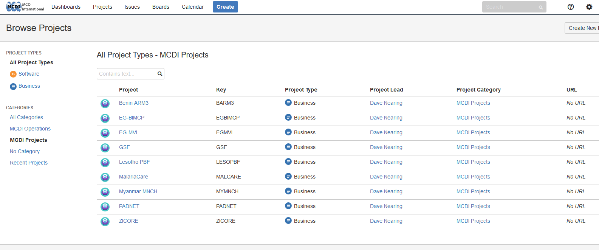
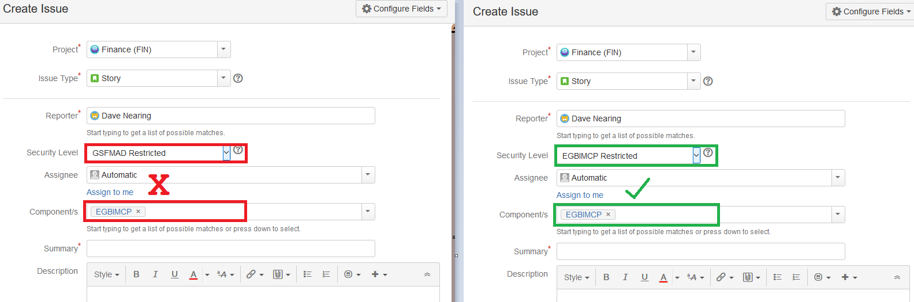

The purpose of this article is to serve as a guide to the structure of MCDI's JIRA installation, with notes on best-practice for future structural modifications.

##General Structure

MCDI's JIRA installation has been designed from the ground up to mirror the best-practice concepts for structural organization as outlined by Atlassian, in an effort to ensure that their system documentation is maximally compatible with our own.  In light of that fact, an effort has been made to include links to relevant articles within the Atlassian knowledge-base for further reading where possible.

[You can view an overview of JIRA Core's structure here](https://confluence.atlassian.com/jiracoreserver072/what-makes-up-jira-core-829092409.html)

###Categories
Categories are collections of projects which share a common attribute.   As an example, the category

**"MCDI Operations"** contains the following projects:


and the category **"MCDI Projects"** contains the following projects:



Giving projects a parent category designation allows for more precise sectioning of structure, allowing for the support of a diverse range of BUs within a single application.

-----

###Projects
Projects are roughly analogous to "Departments" or "Business Functions" within the application context.  Projects serve as "buckets" for issues (see below).  Each project has a long-form name, like

* Business Development
* Finance
* Benin ARM3

and a short-form name ("slug") like

* BD
* FIN
* BARM3

The long-form name is utilized primarily for navigation within the UI, whereas the slug is used primarily for referencing issues.

-----

###Issues
The most basic "work packet" in JIRA is the issue.  There are multiple types of issues, which all serve different functions.  For more detail about issue types and their roles within JIRA, please peruse the [Issue Types](issue_types) page.

When an issue is created, it is assigned a unique identifier comprised of the slug of the parent project and the index of the issue within the project context, i.e.

* HR-1
* BARM3-14
* ZICORE-9
```ruby
    Power Tip: simply typing the identifier of an issue within a comment or description field will generate
    an interactive link to that issue.
```

-----

####Components

In contrast to SharePoint, "Component" is a predefined keyword within JIRA that is utilized for the subdivision of issues within a project.  "Epics" (discussed below) take the place of SharePoint components.  

The component attribute is most useful in projects that interact with many other projects, such as Finance and HR, but also has a place in smaller projects as a tool for indicating "categories of work" (i.e. Work Planning/Management/etc.).   By way of example, take a look at the currently configured components within the HR project:


This change makes it unnecessary to create "subsites" for things like Finance and HR within each project, opting instead for a clearinghouse paradigm where data is organized in a top-down fashion, rather than from the bottom-up.

To illustrate, let's say that you want to create a task in the (FIN) project for the procurement of widgets for the ZICORE project.  In order to do this, you would create a story or subtask under the Finance project (see [Issue Types](issue_types) for more information on creating issues), and assign it to the ZICORE component, as shown here:


In the case of the majority of clearinghouse-style projects (especially Finance and HR), you would also need to select an Issue Security level before saving the issue.

-----

####Issue Security (ISSEC) Levels

JIRA introduces the concept of ISSEC levels to provide an additional dimension of security for "eyes only" data.  Not all projects utilize an ISSEC dimension, relying instead on project-level permissions for access control.  As a general rule, projects which operate according to the clearinghouse paradigm (FIN/HR/etc.) generally have an ISSEC dimension, whereas projects which are self-contained (ZICORE/BARM3/etc.) generally *do not* have an ISSEC dimension.  

The vast majority of ISSEC dimensions follow the below pattern (where X is a project slug), arranged from highest security to lowest:

* X Restricted
* X
* None

If a project does have an ISSEC dimension, a field labeled "Security Level" will appear on the issue creation screen for that project.  


From a user perspective, you will only be able to create issues with ISSEC levels for which you have clearance, so for the majority of users, the number of choices available within a given "Security Level" dialog will be fairly small.  It is **important** to match the ISSEC clearance with the selected component.  The rule of thumb for this is to simply ensure that the slug you select in the "Component" field (i.e. ZICORE) matches the leading slug of the ISSEC level you select in the "Security Level" field.


