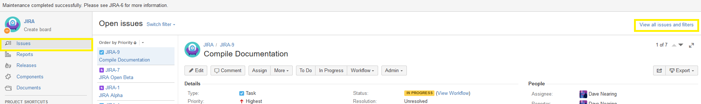

The purpose of this article is to provide information related to the use of the stock reports included in JIRA.

##Report Dashboard
To access the Report Dashboard, select the "Reports" tab on the left-hand pane within a project.

Once you have reached the Report Dashboard, you can select from all of the available reports within the MCDI Jira instance.  There are a wide range of reports available by default, and [you can learn about them in more detail here](https://confluence.atlassian.com/jiracoreserver072/reporting-829092747.html).

Please note- any reports relying on time tracking features for data will not work, as time tracking is not enabled across MCDI's JIRA instance.
