## Step 1: Set Firefox as your default browser.

While JIRA is supported by all major browsers, MCDI's JIRA installation relies heavily on the [Smart Attachments plugin](https://marketplace.atlassian.com/plugins/com.stiltsoft.jira.smart-attachments/server/overview), which only intuitively supports Internet Explorer and Firefox.  For the purposes of ensuring cross-platform functionality, security, and utility, MCDI IT **strongly** recommends using Firefox.

If you are not sure how to set your default browser in Windows 10, you can follow the procedure displayed in [this video](https://vid.me/UhC6) and select Firefox instead of Internet Explorer when you reach the Default Programs screen.

Any existing Firefox installation should include the WebDAV Launcher and the required bindings to allow you to use the "Edit in Office" button when dealing with attachments.  However, if you should run into a problem with that function not working as intended, please refer to the steps under the "Supported Browsers" heading [here](https://docs.stiltsoft.com/display/public/CATAT/Editing+Office+Documents) to resolve the issue.

###Imagus Add-on
It is recommended that you install the [Imagus](https://addons.mozilla.org/en-US/firefox/addon/imagus/) add-on for Firefox.  This add-on will give you the ability to view full-sized images by hovering over image thumbnails with your mouse.  It will make it easier for you to view the details of the screenshots contained within this manual.

## Step 2: Configure Outlook for JIRA

Due to the way that JIRA parses Outlook emails, it is necessary for you to insert an escape string above your signature in Outlook before you start interacting with JIRA over email.  To do this, open the Outlook "File" menu and select "Options."  You will see the following screen:

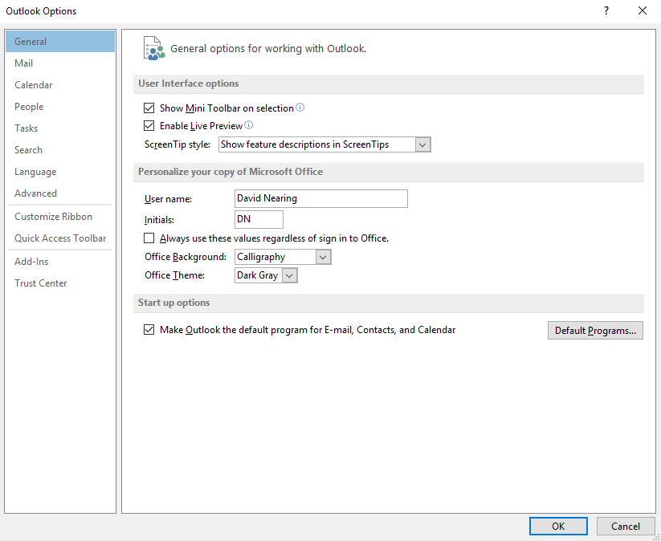

Click "Mail," which will take you to this screen:

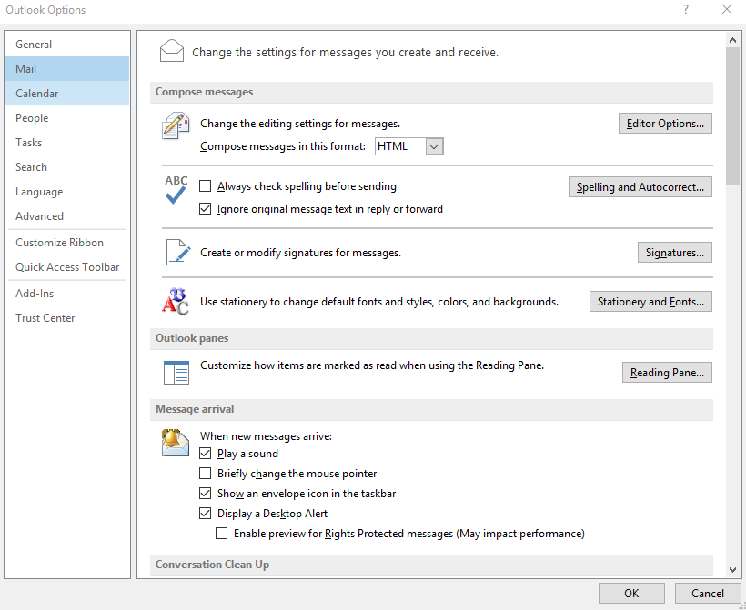

Click the "Signatures..." button, which will open this dialog:

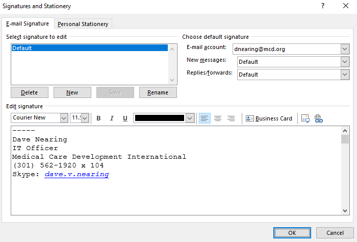

Please modify your signature to include five minus signs above any existing text/pictures, as shown in the screenshot, then click "OK."

## Step 3: Set up your JIRA account

Once IT has reviewed your JIRA permissions slip, you will receive the following email from JIRA inviting you to sign up:

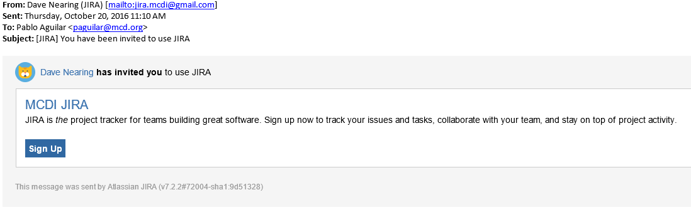

Once you receive the email, click the "Sign Up" button, which will take you to the MCDI JIRA site, where you will see the following screen:

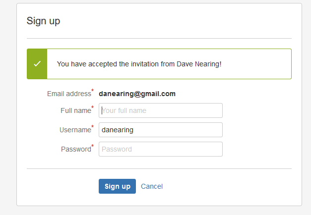

Do not alter your username, simply make note of it, fill in your full name and create a password for yourself.  Once you have done so, click the "Sign Up" button.  This will take you to the following screen:

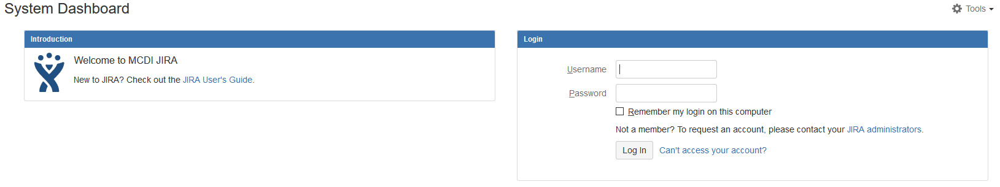

Enter your username in the Username field, enter your password in the Password field, and click the "Log In" button.  The first time you log in, you will be taken through a number of configuration screens.  

Select your desired system language from this screen, and click "Continue:"

*Please note that this selection will only apply to system messages and options*- JIRA does not automatically translate comments made by users in other languages to your selected language.

Once you have selected your language, you will be asked to choose/create an avatar to visually represent you on the site.  Click "Choose an avatar" when the screen below appears.

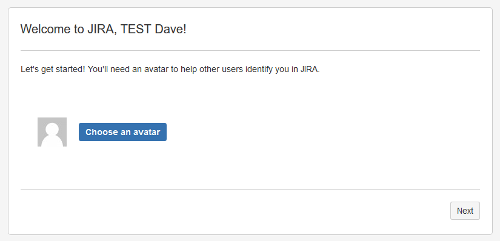

When you click the button, the following overlay will appear:

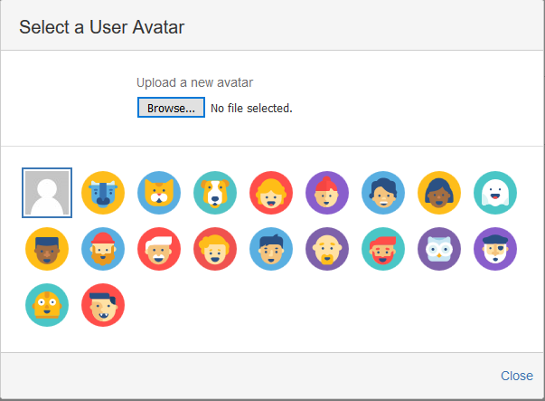

Here, you can select from the default avatars, or upload a custom avatar.  If you choose to upload a custom avatar, please ensure that it is appropriate and "safe for work."  

Once you have selected an avatar, the overlay will disappear, revealing the following screen:

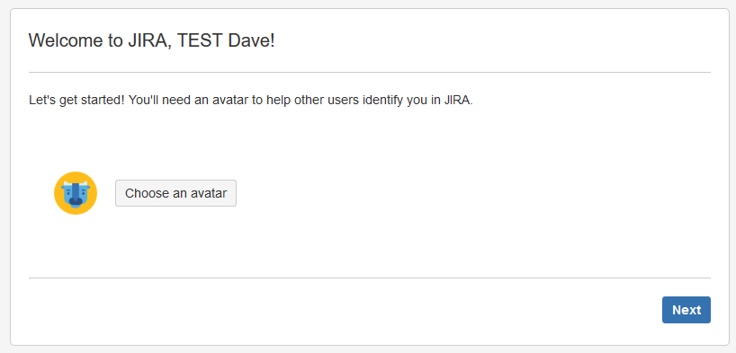

Click "Next."  You will be moved to the screen below.

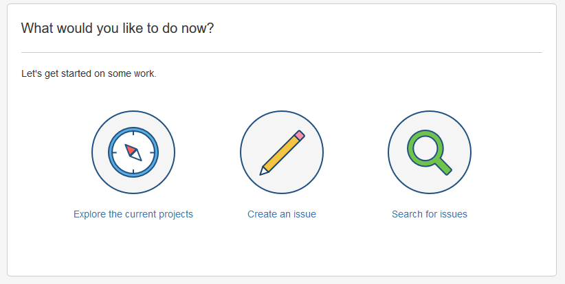

Click "Explore the current projects."  The following screen will appear:

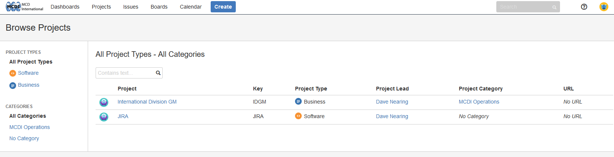

At this stage, your account is set up, but you will only see the default projects which are available to all users.  This is normal, as IT cannot assign permissions to users until their account has been created for security reasons.

Once you have reached this screen, please notify IT that you have set up your account, and you will receive your assigned permissions as soon as possible.

While you wait, please feel free to browse the other documentation provided on this site.
