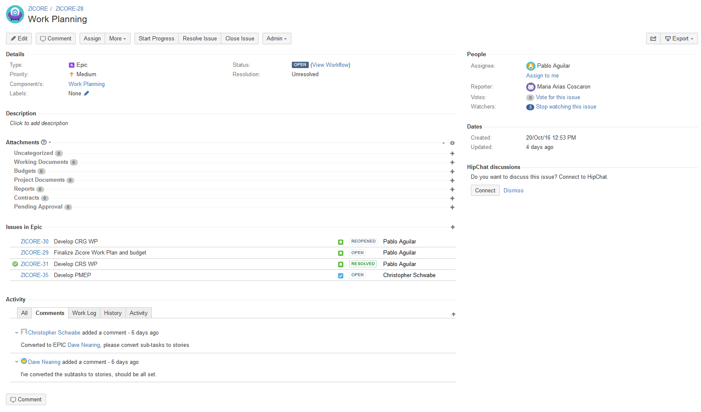
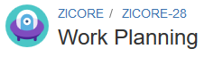
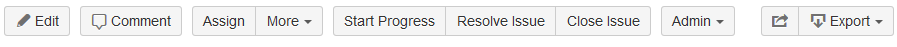
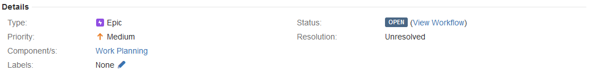
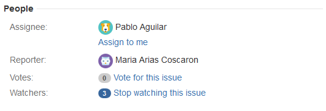

The purpose of this guide is to provide access to detailed information regarding working with Issues in the context of MCDI's JIRA installation.

##Atlassian Documentation

MCDI's JIRA installation has been designed from the ground up to mirror the best-practice concepts for structural organization as outlined by Atlassian, in an effort to ensure that their system documentation is maximally compatible with our own.  In light of that fact, an effort has been made to include links to relevant articles within the Atlassian knowledge-base for further reading where possible.

[You can view an overview of working with issues in JIRA Core here.](https://confluence.atlassian.com/jiracoreserver072/working-with-issues-829092755.html)

-----

##General Notes

MCDI's JIRA instance is currently configured to serve two different types of projects:

* **JIRA Core** projects, which the majority of users will utilize for day-to-day work.
* **JIRA Software** projects, which will be utilized primarily by IT for managing development activities.

```Ruby
Note: A third type of project, the JIRA Helpdesk project, is supported for first-line IT and Customer Service
functions, but not implemented at this time.
```

Depending upon the project type, the available issue types and their use cases will change.  Please refer to the appropriate section for your use case.

[JIRA Core Issue Types](core_issue_types) (partially complete)

[JIRA Software Issue Types](software_issue_types) (not yet available)

-----

##Anatomy of an Issue

When accessed, each issue will display a screen like the one below.  This screen can be broken down into a number of regions, which all serve different functions.  In this section, a detailed overview of the functions and vocabulary related to each region will be laid out for easy reference, moving from the top right to the bottom left.



###Issue Header



The Issue Header region shows three important pieces of information:

* The name of the parent project (ZICORE)
* The issue's ID (ZICORE-28)
* The name of the issue (Work Planning)

###Issue Toolbar



The issue toolbar gives you easy access to some of the most important functions within an issue.

* Clicking the "Edit" button will open a form where you can edit multiple fields at once before saving.
* Clicking the "Comment" button will snap your view to the Comment region and open an editor for you so that you can leave a comment on the issue.
* Clicking the "Assign" button opens a dialog which allows you to reassign an issue to another user and leave a comment about the assignment change.
* Clicking the "More" button will open a menu with advanced functions not covered here...yet.
* The next three buttons and their usage will change depending on the workflow configured for the issue type.  Please see [Default Workflow Usage](workflows.md) for more information.
* The "Admin" button will not be visible for the majority of users, but gives access to multiple power-user functions.
* The square button with the arrow coming out of it is the "Share" button.  This button reveals a dialog which will assist you in creating an external link to the issue.
* Clicking the "Export" button will reveal a set of options for saving the issue to your local machine in various formats.

###Issue Details



The Issue Details region allows you to quickly view the essential metadata of an issue.

* The "Type" field shows you what type of issue the issue is.  Please see [the issue type section for your project](#general-notes) for more information.
* The "Priority" field shows you the issue's current priority level.
* The "Component/s" field not only shows the configured component/s for an issue, it provides hyperlinks to these components, which can be used for navigational purposes.
* The "Labels" field shows all of the keywords which other users have tagged the issue with.  Labels allow users to add ad-hoc semantic search dimensions to issues for future reference.
    * To add a label, click the pencil next to the field, type in your desired label/s, and click the check mark.  
* The "Status" field shows the icon for the workflow step that the issue is currently in.  
    * Clicking the "View Workflow" link will show you a flowchart for the workflow, in case you need a cheat sheet.
* The "Resolution" field will be updated with a resolution message once the issue has been resolved.  Please see [Default Workflow Usage](workflows.md) for more information regarding issue resolution.

###People



The People region gives you a window into the other users interacting with the issue alongside you.

* The "Assignee" field shows you the current user assigned to the task.  
    * The Assignee role is explained in more detail on the [Default Workflow Usage](workflows.md), but essentially, the Assignee is the user who needs to take the next step in moving the issue along through the workflow.  
    * If you need to take over the Assignee role, you can click the "Assign to me" link in order to take ownership.
* The "Reporter" field shows the name of the user that initially reported the issue.  This knowledge can be useful if you're looking to find a source for more information about a given issue.
* The "Vote" field shows a tally of the number of users who have clicked the "Vote for this issue" link, indicating that they would like it to be given priority over other issues.  
    * There is no formal requirement that issues with a high number of votes be given priority, however, this can be a useful tool for making decisions about your time when faced with multiple open issues.  
    * **Please vote sparingly.**
* The "Watchers" field shows the number of people who are currently receiving email notifications for the issue.  
    * As a general rule, any time you interact with an issue in any way other than viewing it (i.e. changing a status, leaving a comment, etc.), you will be added to the Watchers list for that issue.  
    * To view a list of users watching the issue, simply click the number in the circle.  
    * To stop watching the issue, click the "Stop watching this issue" link.
    * To re-subscribe to the issue as a watcher, click the "Start watching this issue" link, which will replace the "Stop watching this issue" link when you are not subscribed.

...to be continued.
